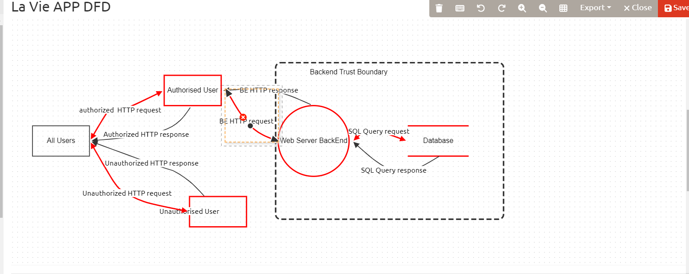
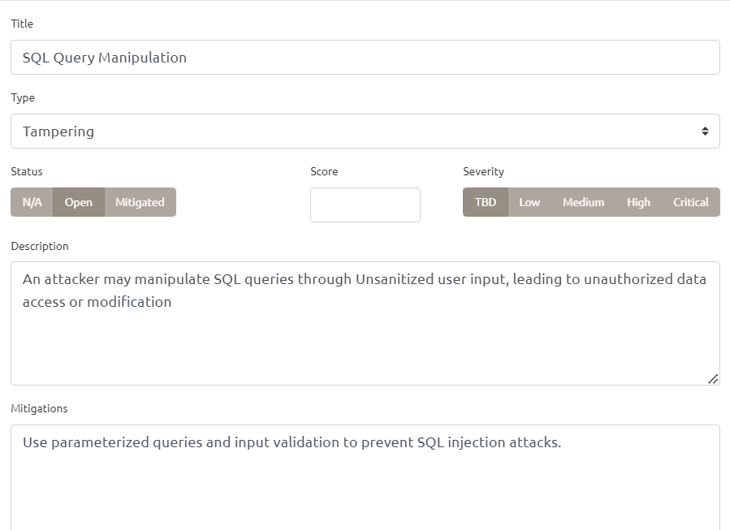
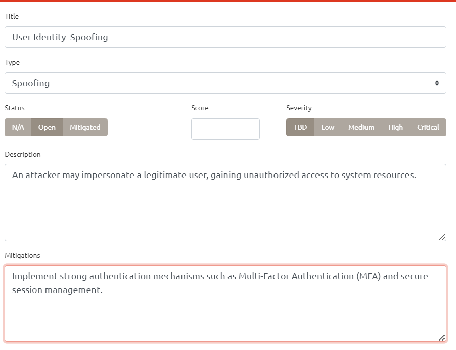
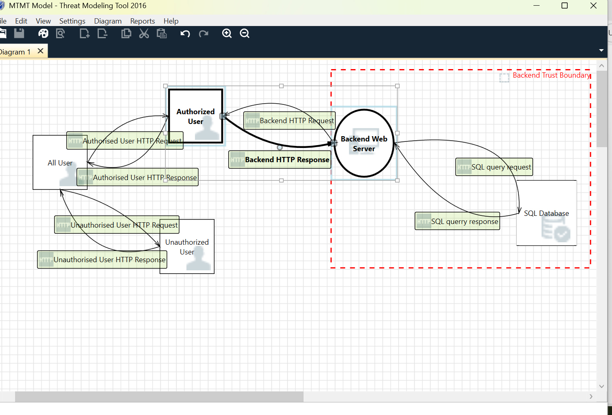
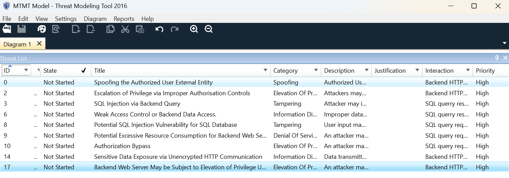
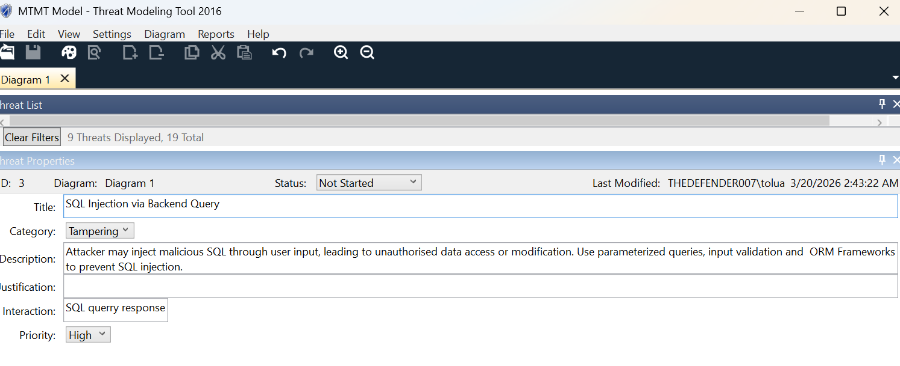

# Threat-Modelling-Project-La-Vie-Application

## 📌 Overview
This project demonstrates a complete threat modelling exercise performed on a web-based application (**La Vie App**) using two industry-recognized tools:

- Microsoft Threat Modeling Tool (MTMT)
- OWASP Threat Dragon

The goal was to identify potential security threats, categorize them using the STRIDE model, and propose effective mitigations.

---

## 🏗️ System Architecture (DFD)

The application consists of:

- External Users (Authorized & Unauthorized)
- Backend Web Server
- SQL Database
- Trust Boundary separating frontend and backend systems

### 🔹 Key Data Flows:
- HTTP Requests/Responses between users and backend
- API communication between frontend and backend
- SQL queries between backend server and database

---

## 🧰 Tools Used

| Tool | Purpose |
|------|--------|
| OWASP Threat Dragon | Manual threat modeling and visualization |
| Microsoft Threat Modeling Tool (MTMT) | Automated threat generation and analysis |

---

## ⚠️ Threat Modeling Approach

The STRIDE model was used to classify threats:

- **S** – Spoofing  
- **T** – Tampering  
- **R** – Repudiation  
- **I** – Information Disclosure  
- **D** – Denial of Service  
- **E** – Elevation of Privilege  

---

## 🔍 Identified Threats

### 1. SQL Injection (Tampering)
- **Description:**  
  An attacker may manipulate SQL queries through unsanitized user input, leading to unauthorized data access or modification.

- **Mitigation:**  
  - Use parameterized queries  
  - Implement input validation  
  - Use ORM frameworks  

---

### 2. User Identity Spoofing (Spoofing)
- **Description:**  
  An attacker may impersonate a legitimate user to gain unauthorized access to system resources.

- **Mitigation:**  
  - Implement Multi-Factor Authentication (MFA)  
  - Use secure session management  
  - Enforce strong authentication mechanisms  

---

### 3. Sensitive Data Exposure (Information Disclosure)
- **Description:**  
  Data transmitted over insecure channels may be intercepted by attackers.

- **Mitigation:**  
  - Use HTTPS (TLS encryption)  
  - Encrypt sensitive data in transit and at rest  

---

### 4. Denial of Service (DoS)
- **Description:**  
  Attackers may overload the backend server, causing service disruption.

- **Mitigation:**  
  - Rate limiting  
  - Load balancing  
  - Traffic filtering  

---

## 📊 Outputs

### 📌 OWASP Threat Dragon
- DFD Diagram
- Threat analysis (SQL Injection, Spoofing)
- Exported Threat Model Report (PDF)

### 📌 Microsoft Threat Modeling Tool
- Auto-generated threats
- Threat filtering and prioritization
- Threat summary and detailed analysis

---

## 📸 Screenshots

### 🔹 OWASP Threat Dragon

#### System Diagram

#### SQL Injection Threat

#### Spoofing Threat

---

### 🔹 Microsoft Threat Modeling Tool (MTMT)

#### System Diagram

#### Threat Summary

#### SQL Injection Threat
 

## 📄 Reports

- 
- 

---

## 🎯 Key Learnings

- Understanding how data flows across trust boundaries  
- Identifying vulnerabilities using STRIDE methodology  
- Differentiating between automated vs manual threat modeling  
- Applying practical mitigations to real-world scenarios  

---

## 🚀 Conclusion

This project demonstrates practical experience in:

- Threat modeling  
- Secure system design  
- Risk identification and mitigation  

It highlights the importance of integrating security early in the software development lifecycle (SDLC).

---

## 👤 Author

**[Tolulope R Arowobusoye]**  
Cybersecurity Enthusiast | Threat Modeling | Application Security  

---
